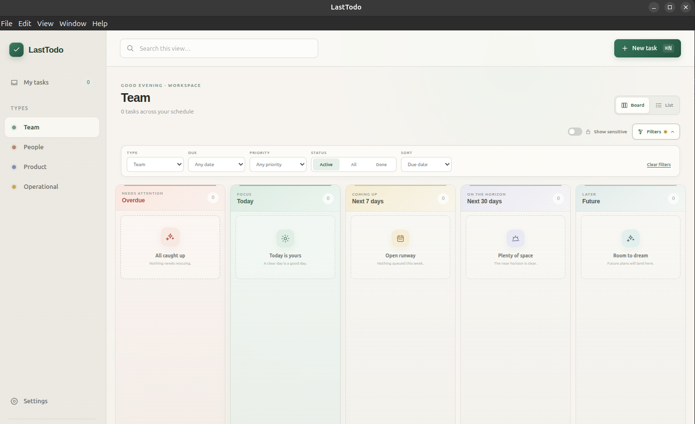

# LastTodo

**A private, opinionated desktop todo app that helps you decide what deserves
your attention now.**



LastTodo organizes work by urgency instead of leaving you with one endless
list. Its board makes overdue work, today's focus, the next week, the next
month, and the future visible at a glance. When plans change, drag a task to a
new lane and LastTodo proposes an appropriate new due date.

Everything is stored in a local SQLite database. There is no account to create,
no service holding your task data, and no subscription. Optional daily backups
can be written to any folder you choose—including a folder synced by iCloud,
Dropbox, Google Drive, OneDrive, or another provider.

## Download LastTodo

Download the newest build from the
**[LastTodo Releases page](https://github.com/emflores/last-todo-app/releases/latest)**.

- **Windows:** download and run the installer `.exe`.
- **macOS:** choose the Apple Silicon (`arm64`) or Intel (`x64`) `.dmg`, open
  it, and drag LastTodo to Applications.
- **Linux:** download the `.deb` for Debian/Ubuntu or the portable `.AppImage`.

Published builds are currently unsigned. macOS Gatekeeper and Windows
SmartScreen may show a warning the first time LastTodo opens. Review the source
and use your operating system's normal one-time **Open** or **Run anyway** flow
if you trust the build.

## Why LastTodo?

- **See what matters next.** The swim-lane board turns due dates into a clear
  view of urgency, while list view provides familiar sorting and filtering.
- **Adapt it to your life.** Create task types, choose an emoji for each, and
  build reusable labels that apply to one or many types—or leave a task
  untyped when it does not need a category.
- **Keep important categories close.** Turn any label into a set of quick,
  clickable filters—useful for people, projects, contexts, or anything else
  you track often.
- **Break work down.** Add subtasks, complete them directly from a task card,
  and attach useful links.
- **Protect private items.** Sensitive tasks stay completely out of board and
  list views until you explicitly choose to show them.
- **Reschedule naturally.** Drag tasks between Today, Next 7 days, Next 30 days,
  and Future; confirm the proposed date before anything changes.
- **Own your data.** Tasks remain in a local SQLite database, with optional
  daily snapshots to a folder under your control.

## Local data and backups

The live database is stored in Electron's platform-specific application data
directory, separate from the installed application. Installing a new version
of LastTodo does not replace your tasks.

Backups are disabled until you choose a folder. Once configured, LastTodo checks
on launch and once an hour, creates at most one consistent snapshot per calendar
day, and keeps up to 15 days of snapshots in that folder's `backups/` directory.
Choose a normal local folder for local protection, or choose a folder managed by
your preferred sync provider to gain off-device cloud persistence.

Packaged builds can check GitHub Releases for a newer version. Updating is
always manual: LastTodo opens the appropriate release download in your browser
and never downloads or installs an update in the background.

## Development

LastTodo is built with Electron, React, TypeScript, and SQLite. The Electron
main process owns persistence, and a small typed preload bridge exposes only the
application's IPC API to the renderer.

### Prerequisites

- Git
- Node.js 22 (the exact development version is in `.nvmrc`)
- npm 10 or newer

`better-sqlite3` is a native module. Most installations use a downloaded
prebuild, but a local compiler toolchain may be required:

- macOS: Xcode Command Line Tools (`xcode-select --install`)
- Windows: Visual Studio Build Tools with **Desktop development with C++**
- Debian/Ubuntu: `build-essential` and `python3`; `fakeroot` and `dpkg` are also
  useful when producing a `.deb`

### Install and run

```bash
nvm use
npm ci
npm run dev
```

The development command runs `@electron/rebuild` so the SQLite addon targets
Electron's ABI, then starts Vite and opens the Electron window with hot reload.
Packaging also rebuilds native dependencies through electron-builder.

#### Linux sandbox setup

On Linux distributions that restrict unprivileged user namespaces, including
some Ubuntu configurations, Electron may report that `chrome-sandbox` is not
configured correctly. Fix the helper's ownership and permissions from the
project root:

```bash
sudo chown root:root node_modules/electron/dist/chrome-sandbox
sudo chmod 4755 node_modules/electron/dist/chrome-sandbox
```

Then run `npm run dev` again. Verify the permissions with:

```bash
stat -c '%U:%G %a' node_modules/electron/dist/chrome-sandbox
```

The expected output is `root:root 4755`. Because `npm ci` recreates
`node_modules`, you may need to repeat this setup afterward.

For a temporary development-only workaround, run
`npm run dev -- --noSandbox`. This disables Chromium's process sandbox, so the
SUID helper setup above is preferred.

For a production-mode smoke test without creating an installer:

```bash
npm run build:app
npm start
```

### Build locally

Run the build on the operating system you intend to use:

```bash
npm ci
npm run build
```

Artifacts are written to `release/`. electron-builder produces DMG/ZIP on
macOS, AppImage/DEB on Linux, and NSIS on Windows. Native dependencies mean this
project is not set up to cross-compile every platform from one machine.

To inspect an unpacked application during development, run
`npm run build:dir`.

### Quality checks

```bash
npm run typecheck
npm run lint
npm test
npm run format:check
```

After running the Electron app, `better-sqlite3` targets Electron rather than
the system Node ABI. If a direct Node test run reports a native binding error,
run `npm run rebuild:node` before `npm test`; `npm run dev` will switch it back
for Electron automatically.

`npm run typecheck` checks the Electron main/preload code and browser renderer
with their respective TypeScript environments.

### Release engineering and updates

Before a schema migration, LastTodo writes a consistent database snapshot to
`migration-recovery/` beside the live database. Existing recovery files are
kept so a failed application upgrade cannot replace its own rollback point.

Release tags must match the version in `package.json`—for example, version
`0.2.0` must be released as `v0.2.0`. The GitHub Actions workflow enforces this
and uploads each platform's installers. Signing is optional for this manual
download flow, although unsigned macOS and Windows builds still show the
operating system warnings described above.

### Diagnostic logs

LastTodo writes structured lifecycle and error events to `main.log` in
Electron's application logs directory. Chromium and native-process diagnostics
are written beside it in `chromium.log`. `main.log` rotates at roughly 2 MB; an
oversized Chromium log is rotated on the next launch. Each keeps one
`.previous.log` file.

The exact directory is printed when the app starts. Typical locations are
`~/Library/Logs/LastTodo` on macOS and the `logs/` folder inside LastTodo's
per-user application data directory on Linux and Windows. Renderer exits,
unresponsive windows, failed page loads, uncaught renderer errors, Electron
child-process exits, and uncaught main-process errors are recorded without task
or database contents.

### Project layout

```text
src/main/       Electron lifecycle, SQLite, domain services, and IPC handlers
src/preload/    Typed, context-isolated window.todoAPI bridge
src/renderer/   React application and styles
src/shared/     IPC contracts shared across processes
spec/           Product specification and implementation plan
```

## License

[MIT](LICENSE)
